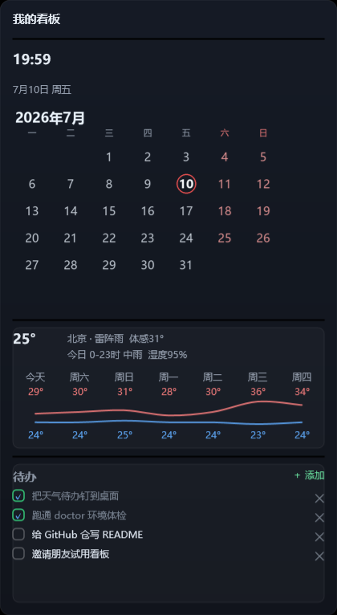
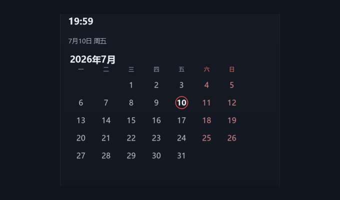
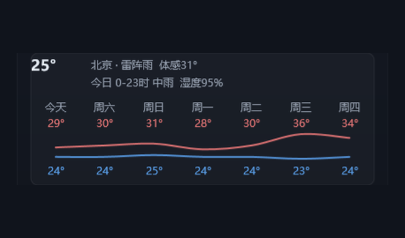
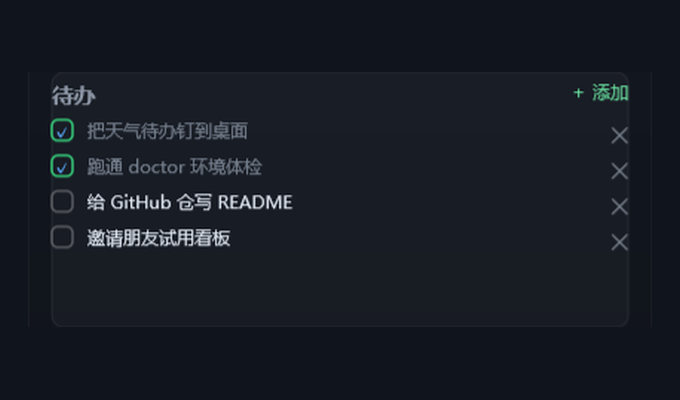
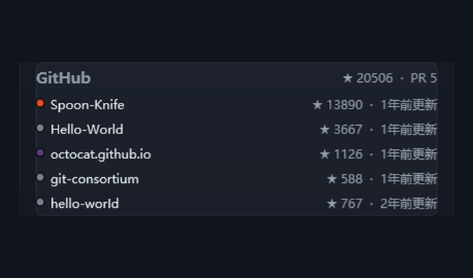
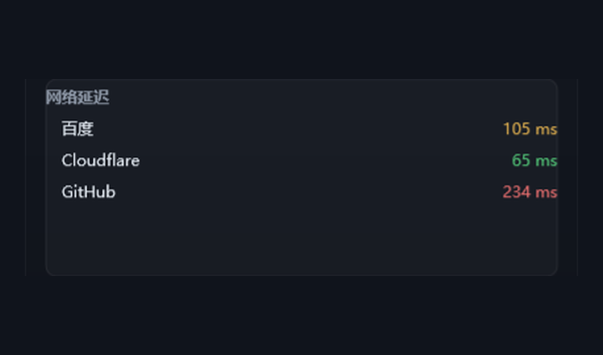
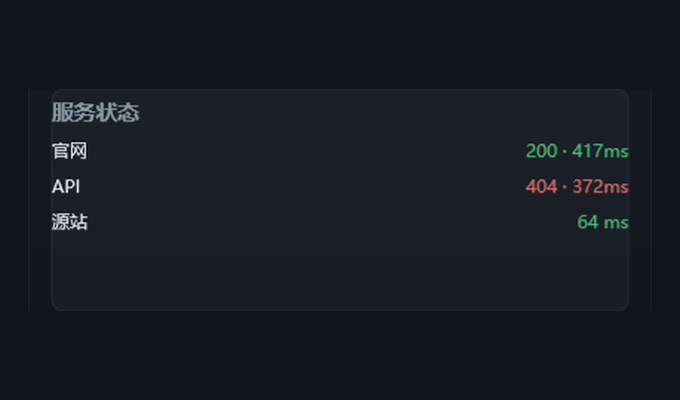

# sansheng-deskdash · 桌面看板施工队

> **你说想看什么,Agent 把它变成常驻 Windows 桌面的一块 —— 原生贴壁纸,不占浏览器,数据自己刷新,坏了自己会喊修。**

**中文** | [English](./README_EN.md)

   

<p align="center">
  
  <br><sub>一块贴在壁纸上的看板:时钟日历 + 天气 + 待办(60 秒即可上墙)</sub>
</p>

---

## 这不是又一个 dashboard —— 三个别人没占的位

大多数「桌面仪表盘」是浏览器标签页或 Electron 大窗,数据源锁死在作者给的那几个。这个 skill 不一样:

1. **原生贴壁纸常驻** — Rainmeter 皮肤直接钉在壁纸上,不是浏览器、不是 Electron;关机重开自动在,零常驻进程占内存。
2. **现场为长尾数据源写采集器** — 库里没有的数据源(自家 NAS、某个有 API 的小服务、你导出的 CSV),Agent **当场写一个只读采集器**贴上去。这是全行业没人做的一层:不是让你从固定清单里挑,而是有 API 就能造。
3. **自愈闭环** — 模块连挂 3 次自动灰化并提示「对我说『修看板』」;你一句话触发,Agent 读诊断数据半自动重修。**绝不无人值守自动改码**(安全红线,见下)。

面向**非程序员**设计(说人话提需求,不碰 Rainmeter INI、不手写脚本),程序员向下兼容。**仅 Windows。**

---

## 60 秒上手

```bash
# 1. 拉仓
git clone https://github.com/sandypoli-boop/sansheng-deskdash.git

# 2. 装成 skill(软链到 ~/.claude/skills;Windows PowerShell,无需管理员)
#    ⚠ 就在 clone 所在目录执行(仓的父目录,别先 cd 进仓),否则 -Target 会指错
New-Item -ItemType Junction -Path "$env:USERPROFILE\.claude\skills\sansheng-deskdash" -Target "$(Get-Location)\sansheng-deskdash"
#    macOS / Linux 概念一致(本 skill 只在 Windows 出图,但仓可放任意机器):
#    ln -s "$(pwd)/sansheng-deskdash" ~/.claude/skills/sansheng-deskdash

# 3. 打开 Claude Code,说一句:
#    “帮我搭个桌面看板”
```

Agent 会自动:环境体检(缺 Rainmeter 提示 `winget install Rainmeter.Rainmeter`)→ 先把时钟钉上墙(**首次失败率设计为零**)→ 问你五个问题(全留空 = 全默认)→ 装模块或现场造 → 常驻刷新。

> 也可用插件市场安装:`claude plugin marketplace add sandypoli-boop/sansheng-deskdash` 然后 `claude plugin install sansheng-deskdash`。

**要求**:Windows · Rainmeter 4.5+ · Python 3.10+(标准库即可)· 可选 `gh`(GitHub 模块提限流)、`Pillow`(日历配图)。

### 国内加速下载

GitHub 直连不畅时,给 clone 地址前面加一层公共镜像即可(下载源码 zip 同理):

```bash
# 加速 clone(把 gh-proxy.com 换成 ghfast.top 即备用镜像)
git clone https://gh-proxy.com/https://github.com/sandypoli-boop/sansheng-deskdash.git
```

插件市场方式暂无稳定国内镜像;网络不畅时用上面的加速 clone + 软链。

## 更新

升级到新版,取决于你当初怎么装的:

- **插件市场装的**:`claude plugin marketplace update` 刷新市场,再 `claude plugin update sansheng-deskdash`
- **clone + 软链装的**:进本仓目录 `git pull`(软链即时生效,不必重装、不必重连)

**怎么知道有新版**:看本仓 [Releases](../../releases);点仓库右上角 **Watch → Custom → Releases**,发新版时 GitHub 会通知你。每版改了什么见 [CHANGELOG](CHANGELOG.md)。

---

## 官方模块画廊

开箱 6 个官方模块 + 3 张起步板(`templates/starter-boards/`),货架不空;截图均为真机渲染。

<!-- GALLERY:START -->

> 本表由 `scripts/gen_readme_gallery.py` 从 `registry/registry.json` 单源生成,请勿手改。

| 截图 | 模块 | 类目 | 评级 | 说明 |
|---|---|---|---|---|
| <a href="modules/clock-calendar/screenshot.png"></a> | **时钟日历**<br><sub>Clock & Calendar</sub> | `time` | 🥉 Bronze | 时钟 + 当月日历,今天高亮;零网络零密钥,最稳的地基。 |
| <a href="modules/weather/screenshot.png"></a> | **天气**<br><sub>Weather</sub> | `weather` | 🥉 Bronze | 当前天气 + 7 天预报(温度曲线);open-meteo 免密可用,可选彩云 token。 |
| <a href="modules/todo/screenshot.png"></a> | **待办清单**<br><sub>Todo</sub> | `tasks` | 🥉 Bronze | 在壁纸上就地勾选 / 新增 / 编辑 / 删除待办;交互旗舰,零网络零密钥。 |
| <a href="modules/github/screenshot.png"></a> | **GitHub 动态**<br><sub>GitHub Activity</sub> | `dev` | 🥉 Bronze | 你的 star / PR 概览 + 热门仓列表;有 gh CLI 走 CLI,否则降级匿名 REST。 |
| <a href="modules/net-latency/screenshot.png"></a> | **网络延迟**<br><sub>Network Latency</sub> | `network` | 🥉 Bronze | 多目标网络延迟(ping / TLS 握手),一眼看网快不快。 |
| <a href="modules/server-status/screenshot.png"></a> | **服务状态**<br><sub>Server Status</sub> | `system` | 🥉 Bronze | 服务健康(HTTP 状态码 + 延迟 / ping),盯自己的站点在不在。 |

<!-- GALLERY:END -->

装模块前,Agent 会**朗读该模块要连哪些域名、读写哪些本地路径、要哪些密钥名**,你点头才装(见「安全模型」)。

---

## 安全模型(诚实声明,不伪装成沙箱)

Agent 会在你桌面上跑它写/装的采集代码 —— 这需要信任。所以边界必须说清楚:

**v1 没有运行时网络沙箱**(Windows 用户态低成本的真沙箱方案不存在)。取而代之是**四层纵深边界**:

| 层 | 做什么 |
|---|---|
| ① privacy 声明制 | 每个模块 `widget.json` 显式声明 `network / local_read / local_write` 三元组;装前向你朗读 |
| ② AST 静态扫描 | `validate_module.py` 扫采集器源码:禁用调用(`eval`/`exec`/`shell=True`/`Invoke-Expression`)、实际请求域名必须 ⊆ 声明 |
| ③ VALIDATE 试跑 | 现场造/改采集器后,先跑一次给你看**实际网络目标 + 真实输出**,你确认才接线上墙 |
| ④ 用户审阅 | 装模块 / 注册后台刷新任务前,都要你点头(三审阅点) |

**禁止项(硬红线)**:采集器只读外部、只写自身/board 目录;禁读浏览器 cookie / 凭据目录;禁访问未声明的域名;皮肤禁 `!Execute` 任意命令 / 远程加载。

**依赖白名单**:采集器默认 **stdlib-only**;唯一例外是 `requests` 与 `Pillow` 两个包,白名单外一律不许,禁采集器内 `pip install`。

**密钥**:只进 gitignore 的 `config.json`,**绝不进代码 / 日志 / 错误消息**(有 secret-canary 测试注入假密钥断言各失败分支不泄漏)。

**Windows 真实阻断**:所有 PowerShell 脚本用 `-ExecutionPolicy Bypass -File` 调用,**不改系统策略、全程无网络下载执行**;计划任务登录后延迟 5 分钟触发(网络未就绪不炸)。

---

## 能造什么 / 不接什么

现场造采集器前,Agent 先过**探源红绿灯**:

| 灯 | 数据源 | 动作 |
|---|---|---|
| 🟢 绿 | 公开 API / 你自备 key 的 API / 本地文件与局域网设备 | 直接造,可回流公开仓 |
| 🟡 黄 | 需你自己提供 cookie 的私有服务(自家 NAS / 路由器) | 造,但**仅本地自用,不回流** |
| 🔴 红 | 需绕登录风控 / 反爬,或 ToS 明确禁止(银行、券商、社交平台私有接口) | **拒绝** + 给降级方案 |

**不接清单**:银行 / 券商 / 微信微博抖音等社交平台私有接口 / 任何要模拟登录绕过风控、破解反爬、违反 ToS 的源。碰到 Agent 会直说:「这个源要绕登录风控,不安全也不合规」,并给两条稳的路(官方公开 API / 你导出 CSV 我读文件)。

> **免责声明**:本 skill 只写**只读**采集器,只访问你/模块**显式声明**的数据源。你对现场造模块所访问的服务与所提供的凭据负责;请勿用它抓取你无权访问或 ToS 禁止的数据。软件按 MIT「as is」提供,不担保。

---

## 贡献

现场造的好模块,可脱敏后提回社区仓,别人就能直接装:

```bash
python scripts/new_module.py <id>            # 生成七件套骨架
# 编辑 collector.py / band.inc / widget.json ...
python scripts/validate_module.py modules/<id>   # 本地校验(与未来 CI 同款),必须先绿
# registry/registry.json 追加一条 → 开 PR
```

模块画廊由 `registry/registry.json` 单源驱动,跑 `python scripts/gen_readme_gallery.py` 幂等刷新本文表格。完整回流流程、模块七件套约定、质量分级见 [`references/contribution.md`](references/contribution.md);现场造的带区/编码/交互约束见 `references/` 其余各篇。

---

## 环境要求

- **操作系统**:Windows(原生贴桌面;非 Windows 不支持皮肤部署与计划任务)
- **Rainmeter** 4.5+(`winget install Rainmeter.Rainmeter`)
- **Python** 3.10+(采集器纯标准库;白名单可选包 `requests` / `Pillow`)
- **可选**:`gh`(GitHub CLI,github 模块提限流 / 读私有仓)、`Pillow`(clock-calendar 画日历图)
- **宿主**:Claude Code 原生;根目录 `AGENTS.md` 桥接其他读 AGENTS.md 的 Agent 宿主

---

## 配套文章 · Article

撰写中,发布后更新链接。

## 关于作者 · About the author

<p align="center">
  <a href="https://sanshengai.top"><strong>🌐 网站 sanshengai.top</strong></a> ·
  <a href="https://namecard.xiaoyuzhoufm.com/nnl8x"><strong>🎧 小宇宙</strong></a> ·
  <a href="https://weibo.com/u/7546221967"><strong>微博</strong></a> ·
  <a href="https://www.xiaohongshu.com/user/profile/5c716b6d000000001000f5c4"><strong>小红书</strong></a> ·
  <a href="mailto:sandypoli@gmail.com"><strong>✉️ 邮箱</strong></a>
</p>

我是**叁笙**,一个用 AI 做内容、也用 AI 造工具的人。我做了个人站「[叁笙早安 AI](https://sanshengai.top)」--
每天清晨一份 AI 早报,加深度长文,还有一堆自己写来自己用的小东西:读书蒸馏、职业 AI 风险测评、
GitHub 宝藏精选、AI 羊毛铺......

这个桌面看板,就是我做这些内容、造这些工具时,想让「今天该盯的数」一眼可见,在真实工作流里
一点点磨出来的。觉得好用,就清洗脱敏开源出来 -- 你可以直接用,也欢迎改成自己的。

如果这些东西对你有用,欢迎来[网站](https://sanshengai.top)逛逛,或**扫码关注公众号「叁笙早安AI」**
(公众号没有跳转链接,扫码最快):

<p align="center">
  
  <br><sub>微信扫码关注 · 叁笙早安AI</sub>
</p>

## Credits & Dependencies · 致谢与依赖

### 致谢

- **[Rainmeter](https://www.rainmeter.net/)** -- 本 skill 的渲染地基。所有「贴壁纸原生皮肤」的能力都由 Rainmeter 提供;本仓只生成它的皮肤配置(`.ini`/`.inc`),不分发 Rainmeter 本体。
- **[Open-Meteo](https://open-meteo.com/)** -- 天气模块默认的免密钥数据源(CC BY 4.0),让「零配置就有天气」成为可能。

### 运行依赖

- **Windows** + **[Rainmeter](https://www.rainmeter.net/) 4.5+**([GPLv2](https://github.com/rainmeter/rainmeter/blob/master/LICENSE),用户自行 `winget install` 安装的独立运行时,**非本仓捆绑**)
- **Python >= 3.10** -- 采集器纯标准库;可选包均**非捆绑、用户自装**:`requests`([Apache-2.0](https://github.com/psf/requests/blob/main/LICENSE))/ `Pillow`([HPND](https://github.com/python-pillow/Pillow/blob/main/LICENSE))/ `tzdata`([Apache-2.0](https://github.com/python/tzdata/blob/master/LICENSE),仅用 IANA 时区名时需要)
- **可选**:`gh`(GitHub CLI,[MIT](https://github.com/cli/cli/blob/trunk/LICENSE),github 模块提限流)
- **Claude Code**(或任何能按 SKILL.md / AGENTS.md 执行的 agent 宿主)

### License 兼容性

本仓以 MIT 分发,**无捆绑任何第三方代码(vendor)**。Rainmeter(GPLv2)是用户自行安装的独立运行时工具,本仓仅生成其配置文件、不分发其本体,故**无 GPL 传染**;上列 Python 包均为运行时依赖、用户自装,许可与 MIT 兼容。

## License

[MIT](./LICENSE)
